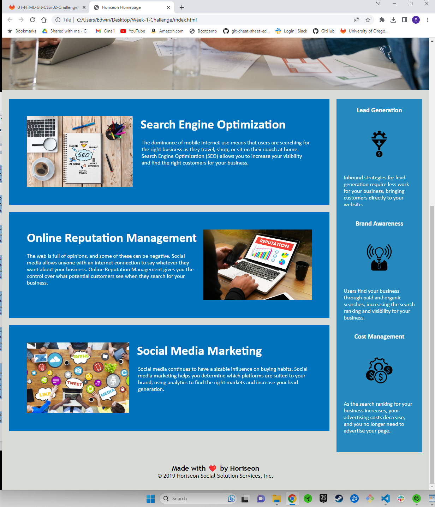
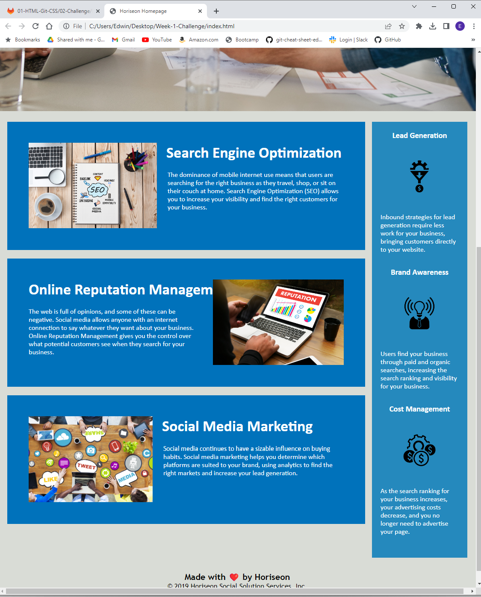

# Code Refactor Starter Code

## Description

I built this project in an effort to practice and improve my skills as a developer. This project is focused on HTML and CSS semantic stucture and flow, particulary with regard to positioning elements. Overall, I have learned that I have much to learn. The project is currently under construction, as improvements are still necessary.

This project can be found here: 

https://edwinalban.github.io/Week-1-Challenge/

## Installation

N/A

## Usage

This project can be used to practice positioning elements on a webpage. As you can see from the screen shotes below, the image in the Online Reputation Management section overlaps the heading when the window is resized smaller. Adjustments are needed.

